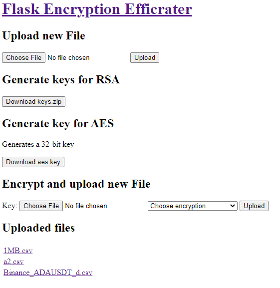

# Flask-encryption-efficrater
A tool for testing the timing of RSA2048 and AES256 encryption standard and streaming in Flask.

An example of the application's layout:


## AES stream
A modified [pyaes](https://github.com/ricmoo/pyaes) library was used for streaming AES encryption.

```python
def _feed_stream(feeder, in_stream, block_size=BLOCK_SIZE):
    """Uses feeder to read and convert from in_stream and yield it."""

    while True:
        chunk = in_stream.read(block_size)
        if not chunk:
            break
        converted = feeder.feed(chunk)
        yield converted
    converted = feeder.feed()
    yield converted
```
